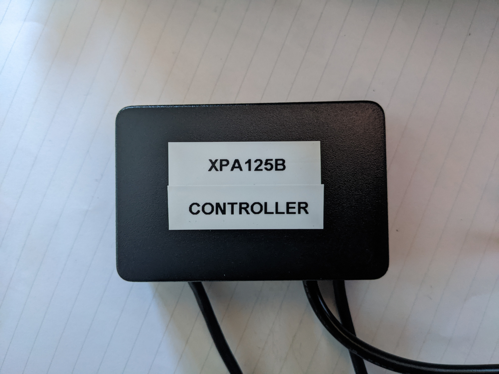
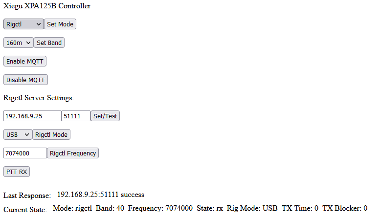
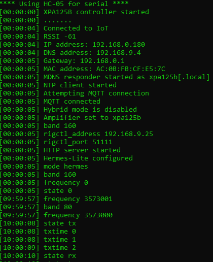

# Amplifier Controller with Network, Bluetooth and Serial Interfaces

Initially designed as an interface for the Xiegu XPA125B, this amplifier network control interface provides support for multiple radios and amplifiers. It provides both PTT and automatic band selection. Although WiFi is required for the APIs you can also operate without network access if prefered. This enables you to use a Yaesu, Icom, SunSDR, Elecraft or Hemes-Lite 2 and have the benefit of automatic band selection. The initial intended use of the controller was to hook directly into `rigctld` (https://hamlib.github.io/) meaning any rig which it supports will also work. Software such as SparkSDR has rigctl built in.

The controller also makes current state avilable via various APIs, including REST, MQTT and serial over Bluetooth. This can be used for further automation and writing custom frontends. You could, for example, use Bluetooth to display the current frequency/band and TX state on a tablet.

Designed and written for a D1 Mini microcontroller using the Arduino IDE.




# Supported Radios:

+ Yaesu (including 817/818)
+ Icom (Bluetooth & RS232)
+ SunSDR
+ Elecraft (KX2 / KX3)
+ Hermes-Lite 2
+ SparkSDR
+ Rigctld (any Hamlib compatible rig)

Built in `rigctl` support is the feature which allows this to work with almost any radio, including SDRs, such as Flex 1500/3000, ANAN and ELAD as well as anything in the Hamlib compatibility list. In addition, some software such as SDR Console, provide a CAT emulation layer, usually using the TS-2000 protocol.

# Supported Amplifiers:

+ Xiegu XPA125B
+ Hardrock-50
+ MiniPA50 (and other Yaesu 817 compatible amplifiers)

Adding additional amplifiers is fairly trivial providing it uses either stepped voltage or serial for band control and PTT is triggered by grounding an input.

# Supported APIs:

+ Serial
+ Web Interface
+ REST
+ MQTT

Even if a particular API isn't the current active mode for control purposes it can still be consumed for state. For example, providing MQTT is configured and enabled it will still publish events such as band/frequency and PTT changes. This allows the current state to be easily consumed by other MQTT compatible software. Similarly for REST, you can always `GET /state` to find out the current PTT state.

# Use Cases

This project has grown arms and legs and is now a powerful tool way beyond its initial intended use. The most useful feature is providing multiple APIs on top of rigctl to allow integration into almost any custom software.

+ Interface any supported radio with any supported amplifier
+ Use any Hamlib compatible radio with a supported amplifier
+ Provide a Web/REST/MQTT/Serial API interface to rigctl
+ Allow automation via Node-RED to any Hamlib compatible radio
+ Build a custom frontend to display frequency, operating mode PTT state
+ Expand to support other radios and amplifiers if desired

# Bill of Materials

Total cost of parts for this project is under £30/$40

+ Small project box
+ WeMos D1 Mini
+ USB cable for D1
+ HC-05 Bluetooth module
+ 4-way logic level shifter (5V to 3V3)
+ Small perf board
+ 2N2222 transistor (or other NPN)
+ Ceramic capacitor
+ Resistors
+ Pin headers
+ Mini DIN cable for XPA125B
+ MAX3232 serial module (optional)

# Schematic

## PTT Trigger

The PTT trigger is connected to the amplifier's PTT detect pin and is responsible for putting the amplifier into TX state. I suggest using a 2N222 transistor for this purpose. The value of the resistor isn't too critical in this application.


Connect the resistor to pin `D1` on the D1 Mini and the other end to the gate of the transistor. The emitter should be connected to ground and the collector to the PTT pin on the amplifier. You must also tie the grounds together between the D1 mini and the amplifier.

## PTT Detect

The PTT detect is used for radios such as the IC-705 or when in `hybrid` mode. This tells the controller the radio is in TX state. This pullup resistor simply makes the pin `HIGH` when in RX state and makes it go `LOW` in TX state.


You could use the internal pullup resistor in the microcontroller by setting the pin to `INPUT_PULLUP` but I've had better luck using an external resistor like this.

Connect one end of the resistor to the `3V3` pin on the D1 mini and the other end to `D3` on the D1 Mini. The radio's TX enabled pin should then also connect to `D3`. Again, you must tie the grounds together between the D1 Mini and the radio.

There is built in debounce logic which you can enable if your radio uses a relay on its TX enabled output or you are using a switch like the MFJ-1708. This isn't usually neccessary but if you notice the controller state oscillating when you TX you probably want to set this to some value of milliseconds. In the controller configuration:

1. Set `debounce_delay` to some value > `0` in milliseconds

If you set this to a value and notice PTT no longer works try increasing the value until it does. I've found `10` works well but you may need to experiment.

## RC Filter

The RC filter is an attempt to filter the PWM voltage from the D1 Mini by means of a 1st order LPF. The PWM frequency is set to 30 KHz in the code and without this filter you might find amplifiers which use stepped voltage for band selection are unstable (randomly switching between bands). The values for the resistor and ceramic capacitor are quite critical and the values given below are just an example. You might find you need to tweak these values. I have seen a 10k resistor and 10uF capacitor work so just experiment.


Connect one end of the resistor to pin `D2` on the D1 mini and the other end to the band selection pin on the amplifier. One end of the capacitor should be connected to the amplifier side of the resistor and the other end to ground. Again, you must tie the grounds between the D1 Mini and the amplifier.

## Logic Level Shifter

When using `yaesu` (except the 817/818) or `SunSDR` as the radio you need to connect a logic level shifter. The low side of the shifter should connect to the D1 Mini pins and the high side to the radio's control port pins.

Note: These pins overlap with the `hc_05`, `max3232` and Hermes-Lite UART interfaces so if you need to use this you can't have any external serial interfaces enabled.

For Yaesu:

+ `BAND-A` pin of the radio to `D5` of the D1 Mini (via the shifter)
+ `BAND-B` pin of the radio to `D6` of the D1 Mini (via the shifter)
+ `BAND-C` pin of the radio to `D7` of the D1 Mini (via the shifter)
+ `BAND-D` pin of the radio to `D8` of the D1 Mini (via the shifter)

For SunSDR:

+ `X3` pin of the radio to `D5` of the D1 Mini (via the shifter)
+ `X4` pin of the radio to `D6` of the D1 Mini (via the shifter)
+ `X5` pin of the radio to `D7` of the D1 Mini (via the shifter)
+ `X6` pin of the radio to `D8` of the D1 Mini (via the shifter)

## Yaesu 817/818

Yaesu radios which use stepped voltage for outputting band selection should have their `BAND` pin connected to `A0` on the D1 Mini. This is the ADC which can read the voltage.

Other radios which use stepped voltage could also be used, though you may need to tweak the relative values in the code.

# Bluetooth module (HC-05)

With the `HC-05 Bluetooth module` (don't mix this up with the HC-06) you can add an additional UART serial interface to the D1 Mini. We can use this for a couple of things.

1. Interfacing with an Icom IC-705 (it presents the CI-V interface over it)
2. Using as a wireless serial port for `serial` mode and reading status updates

The controller has a built in programming mode for the HC-05 which allows you to use the D1's serial interface to change settings on the HC-05 in AT command mode. Essentially it relays messages back and forth between the two serial interfaces. First, connect the HC-05 to the D1 mini:

1) `VCC` on the HC-05 to the D1's `5VDC` pin
2) `GND` on the HC-05 to the D1's `GND` pin
3) `TXD` on the HC-05 to the D1's `D4` pin
4) `RXD` on the HC-05 to the D1's `D5` pin

In the controller's config, set the following:

1. `use_bluetooth_serial` to `false`
2. `hc_05_enabled` to `true`
3. `hc_05_program` to `true`
4. `hc_05_baud` to `9600`

Before applying power to the D1 mini, hold the button on the HC-05, apply power, let go of the button after two seconds. The LED shold start blinking slowly (as opposed to the fast blinking it usually does). Now we can program it using `AT` commands.

1. Open a serial connection to the D1 Mini (115200 baud)
2. Set the newline characters to `NL+CR` or `CR+LF`
3. Send `AT` and you should see an `OK` back. This should happen after every succesful command
4. Send `AT+NAME:XPA125B` - this sets the Bluetooth name to `XPA125B`
5. Send `AT+PSWD:"6245"` - this sets the PIN to 6245 (just an example)
6. Send `AT+UART:9600,0,0` - this will make the default baud rate `9600`

Note: In AT command mode the HC-05 expects a baud rate of `38400` so the controller automatically uses this rate in programming mode. I've found using a lower baud rate works best for normal operation but you should experiment.

That's the programming done so disable programming mode on the controller:

1. Set `hc_05_program` to `false` on the controller
2. Remove power from the HC-05 / D1 mini
3. Reapply power

The LED should start blinking fast and is waiting for a client connection. See the `Bluetooth Serial Console` below for examples of how to connect to it.

# MAX3232

The MAX3232 is an RS-232 transceiver which operates at 3V3 TTL so is perfect for a D1 Mini. We can use this for interfacing with RS-232 based devices, such as:

1. Elecraft KX2/KX3 radio
2. Hardrock-50 amplifier

If you wanted to run an Elecraft radio with the Hardrock-50 amplifier you could set the Hardrock-50 to `Yaesu 817` mode and use stepped voltages for control instead of serial. In that case in the controller configuration set `amplifier` to `minipa50` and connect the band pin on the Hardrock-50 to pin `D2` on the controler. See the amplifier's manual for more details.

By default the MAX3232 uses the same pins as the Hermes-Lite UART interface and Band Data pins for Yaesu/SunSDR so decide which you need for your scenario. You could of course reassign the pins for the combination you need.

1) `VCC` on the MAX3232 to the D1's `5VDC` pin
2) `GND` on the MAX3232 to the D1's `GND` pin
3) `TXD` on the MAX3232 to the D1's `D6` pin
4) `RXD` on the MAX3232 to the D1's `D7` pin

In the controller configuration:

1. Set `max3232_enabled` to `true`
2. Set `max3232_baud` to `9600` (the higher you go the more chance of corruption)

That's it as far as configuration goes. Ensure whatever baud rate you chose is matched to the device plugged into it.

# Configuration

The top of the file contains config options which need set first:

+ `wifi_enabled` - change to true if you want WiFi
+ `ssid` - your WiFi SSID
+ `password` - your WiFi password

Also set NTP details:

+ `ntp_server` - set to `pool.ntp.org` if unsure
+ `ntp_offset` - number of seconds to offset the displayed time by
+ `ntp_interval` - update interval in milliseconds

If you want to enable MQTT set the following:

+ `mqtt_enabled` = true
+ `mqttserver` = <host>  (MQTT server hostname or IP address)
+ `mqttuser` = <username>  (MQTT username)
+ `mqttpass` = <password>  (MQTT password)
  
# Hybrid Mode
  
It is recommend to use this feature if your radio supports it. There is an option to always use the PTT detection pin `D3` even when the current mode supports PTT directly. A typical example is when in `rigctl` mode usually PTT state is determined by requesting it directly from rigctld in a polling fasion. However, if your radio has a PTT output (which goes to ground when it is TX'ing) you can wire this up to the controller and use it to detect PTT.
  
There are two main advantages to this method:
  
1. Reliability - you could argue this analog approach is more reliable than requesting state via a communications protocol
2. Latency - because this method uses an interrupt in the controller it will always be quicker to react
  
To enable this mode simply set the following in the controller configuration:
  
1. `hybrid` to `true`
  
Now, reguardless of mode, PTT will be handled by waiting for the state of `D3` to change.
  
# Rigctl

To make rigctl default on boot first ensure WiFi credentials are filled in and also set:

+  `mode` = rigctl
+  `rigctl_default_enable` = true
+  `rigctl_default_address` = <IP address> (rigctl IP address)
+  `rigctl_default_port` = <port> (rigctl port)
  
As an example, if you want to use SDR Console as the rig, first enable CAT control and attach it to one end of a pair of virtual com cables, then run rigctld:

`rigctld.exe -r COM18 -m 2014 -s 57600 -t 51111`
  
 You need to ensure the port is allowed through the firewall.
  
 In the above we are using `COM18` as the other end of the virtual com cable. `2014` is the rig ID for a Kenwood TS-2000 which SDR Console emulates. The port `51111` is what you would then set `rigctl_default_port` to. This method also works with PowerSDR  and Thetis for Flex 1500/3000, Hermes-Lite and ANAN radios.
  
  Other software such as SparkSDR (https://www.sparksdr.com/) has rigctld built in so no need to run the daemon - simply point the controller to the IP/port of SparkSDR directly (you must enable CAT control). This is the ideal way to run the controller and perfect for radios such as the Hermes-Lite (http://www.hermeslite.com/).
  
 You can control basic functions of the rig ('rig' could also be SDR Console/SparkSDR etc) via the Serial, REST and MQTT APIs. Namely frequency, mode and PTT. For example, to set the current frequency of the rig via REST:
  
  `curl -s -d 'freq=7074000' http://xpa125b.local/setrigctlfreq`
  
 In essense this operates as an API translation layer to rigctl.
  
 If you want to use rigctl for band selection but prefer PTT to be via the control cable you can set `hybrid` to `true`. This will substantially reduce latency but requires your radio to have an output which goes to ground when it is TX'ing.
 
 If you are using `rigctld` on Windows you need a recent version of Hamlib due to a bug I discovered while developing this controller. More details here: https://github.com/Hamlib/Hamlib/issues/873.

# Xiegu XPA125B Amplifier
  
To use this amplifier first connect the following:
  
1. Pin 2 of the ACC socket on the amp to the collector of the 2N2222 transistor
2. Pin 3 of the ACC socket on the amp to the output of the RC filter
  
Note: Ensure grounds are also tied between the amplifier and the D1 Mini.
  
Then, in the controller configuration:
  
1. Set `amplifier` to `xpa125b`
  
The amplifier will now work with both PTT and automatic band selection.
  
# MiniPA50 Amplifier
  
This will work with any amplifier designed for the Yaesu 817/818 and indeed any amplifier which uses the same stepped voltages for band selection.
  
To use this amplifier first connect the following:
  
1. PTT pin of the ACC socket on the amp to the collector of the 2N2222 transistor
2. Band pin of the ACC socket on the amp to the output of the RC filter
  
Note: Ensure grounds are also tied between the amplifier and the D1 Mini.
  
Then, in the controller configuration:
  
1. Set `amplifier` to `minipa50`
  
The amplifier will now work with both PTT and automatic band selection.
  
# Hardrock-50

## Hardrock Serial mode
  
To use this amplifier in serial mode you need a MAX3232 connected to the controller - see the MAX3232 section above for more information. Then connect the following:
  
1. Pin 4 of the ACC socket on the amp to the collector of the 2N2222 transistor
2. Pin 2 of the ACC socket on the amp to the TX pin on the MAX3232
3. Pin 3 of the ACC socket on the amp to the RX pin on the MAX3232
  
Note: Ensure grounds are also tied between the amplifier and the D1 Mini.
  
In the controller configuration:

1. Set `max3232_enabled` to `true`
2. Set `max3232_baud` to `9600`
3. Set `amplifier` to `hardrock50`

Finally, in the Hardrock-50's menu, set `ACC Baud Rate` to `9600`
  
## Hardrock Yaesu 817 mode
  
The Hardrock-50 also supports band selection via stepped voltage, the same as the MiniPA50. Connect the following:
  
1. Pin 4 of the ACC socket on the amp to the collector of the 2N2222 transistor
2. Pin 2 of the ACC socket on the amp to the output of the RC filter
  
Note: Ensure grounds are also tied between the amplifier and the D1 Mini.
  
In the controller configuration:

1. Set `amplifier` to `minipa50`

In the Hardrock-50's menu:
  
1. Set `Yaesu 817` Mode to `Yes`
  
That's it. The amplifier will now work with automatic band selection.
  
# Yaesu Mode

Most Yaesu radios (except the 817/818 - see below) use a similar method to SunSDR. There are four pins named Band A - D. We read the logic levels of the pins from the ACC port to determinte the band. This is effectively a 4 bit value. PTT is handled via another pin called 'TX GND'.

Because the voltage on the pins are 5VDC we need to level shift them down to 3V3 so as not to damage the D1 Mini. An Arduino is 5VDC logic level so doesn't require such shifting. You only need to shift the band pins so a 4 way logic level shifter is perfect.
  
1. Wire the radio's ACC port Band pins (as described in the `Logic Level Shifter` section)
2. Wire the radio's ACC port TX GND pin to `D3` on the D1 Mini
2. Configure the controller with `mode = "yaesu"` and ensure `hl_05_enabled = false` (no other config needed)
  
Note: Ensure grounds are also tied between the radio and the D1 Mini.

You can still enable WiFi and/or MQTT with this mode if desired. This allows you to have access to the other APIs and web interface aswel as push MQTT events but have control entirely handled locally.
  
# Yaesu 817 Mode

The Yaesu 817 & 818 radios use a different method for band selection. They have a stepped voltage output so we use the ADC in the D1 Mini to read this voltage and determine the band.

1. Wire the radio's ACC port Band pin to `A0` on the D1 Mini
2. Wire the radio's ACC port TX GND pin to `D3` on the D1 Mini
2. Configure the controller with `mode = "yaesu817"` (no other config needed)
  
Note: Ensure grounds are also tied between the radio and the D1 Mini.

# Icom IC-705

A popular QRP radio is the Icom-705 and the XPA125B makes a good companion in situations where you need extra power. The problem is only PTT works using a cable from the radio to the amplifier - no automatic band selection. 

## Solution 1

The preferred method of interfacing the controller with an IC-705 is to use the Blueooth feature built into the radio. With this method the radio presents the CI-V interface over bluetooth which connects to the HC-05 module of the controller. We use this to request the frequency (and thus band) from the radio. This method requires no network connectivity of the controller if you don't want or need access to the other APIs.
  
  1. Change the Bluetooth Data setting on the IC-705 to CIV Data (Echo Back).
  2. Connect the controller (name 'XPA128B') in the Bluetooth menu. Security code is whatever you chose when configuring the HC-05.
  3. Connect the control cable to the 3.5mm port on the IC-705 (this is used for PTT detection).
  4. Configure the controller with `mode = "icom"` and `hl_05_enabled = true` and `icom_interface = "hc_05"` (no other config needed)
  
## Solution 2
  
This solution just needs the controller and a computer. It works with any Hamlib supported radio including other Icoms and Kenwood etc.

To solve the lack of band selection you can utilise `rigctld` running on a computer. Most stations have a computer of some kind for logging etc so this feels an adequate solution. You can use either the built in `rigctl` mode or run the controller over serial using the method in the `Serial Example` secion below.

  1. Plug the 705 into the computer via USB.
  2. Run rigctld in a terminal (assumes Windows): `rigctld.exe -r COM3 -m 3085 -t 51111`.
  3. Configure the controller in `rigctl` mode with the IP address of the computer and port `51111`.
  
  Ensure the COM port is correct for your radio and you are using the latest version of Hamlib. The hamlib rig ID for the Icom 705 is `3085`.
  
  If you want to use the controller without network access you can use the example serial scripts under Linux. Although Windows has the Linux subsystem you can't access the serial ports (annoying). Here is how you could do this under any version of Linux (a Raspbery Pi would be perfect).
  
  1. Plug the 705 into the computer via USB.
  2. Plug the controller into the computer via USB
  3. Configure the controller with `mode = "serial"` (no other config needed)
  4. Find the serial device for the radio (`ls /dev/serial/by-id`)
  5. Find the serial device for the controller (`ls /dev/ttyUSB*`)
  6. In a terminal: `rigctld -r <path to radio serial device> -m 3085 -t 51111`
  7. In a terminal: `./amp_serial_control.sh localhost 51111 <path to controller serial device>`

That's it - you now have PTT and automatic band selection. For other software, such as WSJX-T, which needs control of the radio you can use `Hamlib` as the radio type and point it at rigctld using `localhost` port `51111`. This method can also be used with the `HC-05` module as explained in the `Bluetooth Serial Console` section.

# Icom 703 / Xiegu G90
  
It is possible to use the MAX3232 serial interface for other Icom and CI-V based radios, including the IC-703 and Xiegu G90, assuming they are presented as RS232.
  
You can achieve this for Icoms with the CT-17 interface they used to make or build your own. The same applies with the Xiegu G90 and any other CI-V radios. To use this mode, in the controller configuration set:
  
1. `mode` to `icom`
2. `icom_interface` to `max3232`
3. `max3232_enabled` to `true`
4. `max3232_baud` to the correct baud rate for the radio/interface

Connect the RX pin on the CI-V interface to the TX pin on the MAX3232 and the TX pin on the CI-V interface to the RX pin on the MAX3232.
  
Finally, connect the PTT trigger on the radio to pin `D3` on the controller.

# SunSDR
  
The SunSDR radios provide an EXT CTRL port which can be used to signal band and PTT. X1 – X7 are programmable and X8 is always PTT. We will use X3 - X6 for band selection.

Because the voltage on the pins are 5VDC we need to level shift them down to 3V3 so as not to damage the D1 Mini. An Arduino is 5VDC logic level so doesn't require such shifting. You only need to shift the band pins so a 4 way logic level shifter is perfect.
  
1. Wire the EXT CTRL port to the D1 Mini (as described in the `Logic Level Shifter` section) and X8 directly onto the ptt_pin
2. Configure the controller with `mode = "sunsdr"` and ensure `hl_05_enabled = false` (no other config needed)

# Elecraft

Elecraft radios such as the KX2 and KX3 provide a serial interface for control. We can use this to request current frequency and band from the rig. You need to use a MAX3232 serial interface with the D1 then wire it up to the 3.5mm ACC1 port on the radio. The jack tip connection is RX data from the MAX3232 and ring is TX data to the MAX3232.
  
1. Connect the radio's ACC port to the controller (3.5mm to RS232)
2. In the Elecraft radio menu set `RS232` to `9600 b`
 
In the controller configuration set:
  
1. `mode` to `elecraft`
2. `max3232_enabled` to `true`
3. `max3232_baud` to `9600`
  
That should be all that's required.

# Hermes-Lite 2
  
There are two ways to interface with a Hermes-Lite 2. Using rigctl via software such as SparkSDR and SDR Console or by using the serial interface.

## SparkSDR

As the SparkSDR software has built in rigctl support you can interface directly with this by putting the controller in `rigctl` mode and setting the IP address and port.
  
1. In SparkSDR, enable CAT control under radio settings (tick `Enable Rigctl CAT`). The assigned port will be displayed.
2. Set `mode` to `rigctl` in the controller configuration
3. Set `rigctl_default_enable` to `true`
4. Set `rigctl_default_address` to the IP address of the computer running SparkSDR
5. Set `rigctl_default_port` to the port displayed when you enabled CAT control
  
This works for both band selection and PTT. You may wish to use `hybrid` mode for PTT to reduce latency if that is important to you. See the hybrid mode section further up for more information. If you want to use this mode, assuming you have the N2ADR board fitted, you can connect the center of the TX RCA socket to `D3` on the D1 Mini. Also ensure grounds are tied between the radio and the controller.
  
## Serial

The Hermes-Lite 2 has a UART interface on the `DB1` header located at the front of the main board. It appears to use the same format as Elecraft and can be connected to the D1 Mini to read the current frequency. There is no need to shift the voltage if connecting directly to the `DB1` header.
  
Assuming you are connecting directly to the `DB1` header in the Hermes:
  
1. Connect pin `2` of the DB1 header in the Hermes to `D7` on the D1 Mini (optional)
2. Connect pin `3` of the DB1 header in the Hermes to `D6` on the D1 Mini
3. Connect pin `13` of the DB1 header in the Hermes to `GND` on the D1 Mini
  
Note: You don't actually need to connect pin `2` to `D7` as no data is sent to the Hermes - it sends the frequency whenever it changes.

Next, in the controller configuration, ensure:
  
1) `max3232_enabled` is `false`
2) `hermes_enabled` is `true`
4) `mode` is set to `hermes`
  
Now automatic band selection will work. For PTT, assuming you have the N2ADR board fitted, you can connect the center of the EXTTR RCA to `D3` on the D1 Mini. Also ensure grounds are tied between the radio and the controller.
  
One suggestion is using stereo 3.5mm chassis mounts on both the Hermes-Lite 2 and the controller for the serial connection. It's quick and easy and allows the use of a standard stereo audio cable to connect them together.
  
# MQTT

As well as allowing control of the amplifier by publishing MQTT events the system is always updating current state to MQTT. You can use this feature to act as a bridge between Rigctl and MQTT. To do this:
  
  1. Configure MQTT server/username/password in the config (ensure `mqtt_enabled` is `true`)
  2. Configure Rigctl settings in the controller and optionally make it the default mode
  
Now every state change will be published as an event to MQTT to be consumed by other software, such as Node-RED (https://nodered.org/) to trigger other actions. You could use this to build a big LED matrix display showing the current frequency and PTT state. This also works with Home Assistant (see below).

Note: This is just an example. You don't need rigctl to use this - state changes are always published to MQTT reguardless of the type of radio in use.
  
# Web Interface
  
A simple web interface is available on port 80 which allows access to basic functionality as well as documentation. This uses REST so anything which can be done here can also be achieved via the API.
  
In order to change band or trigger PTT from either the web or REST interface you must set the `mode` to `http`. This can be done using `setmode`. See below for further details.
  

  
# Valid serial commands (115200 baud):
  
In order to change band or trigger PTT from the serial interface you must set the `mode` to `serial`. This can be done using `setmode`. See below for further details.

+ serialonly [true|false] (disables every other mode and wifi entirely)
+ setmode [yaesu|yaesu817|icom|elecraft|hermes|serial|http|mqtt|rigctl|none]
+ setstate [rx|tx]
+ setband [160|80|60|40|30|20|17|15|12|11|10]
+ setfreq [frequency in Hz]
+ setrigmode mode=[rigmode] (USB/FM etc)
+ setmqtt [enable|disable]
+ setrigctl [address] [port]
+ setrigctlfreq freq=[frequency in Hz] (only available in rigctl mode)
+ setrigctlmode mode=[mode] ('mode' depends on radio - only available in rigctl mode)
+ setrigctlptt ptt=[0|1] (only available in rigctl mode)
  
Note: There are no commands to get current states over serial. The reason being all state changes are written to the serial interface when they occur so you need to parse and track them as they appear.

# Valid HTTP POST paths:

+ /setmode mode=[yaesu|yaesu817|icom|elecraft|hermes|serial|http|mqtt|rigctl|none]
+ /setstate state=[rx|tx]
+ /setband band=[160|80|60|40|30|20|17|15|12|11|10]
+ /setfreq freq=[frequency in Hz]
+ /setrigmode mode=[rigmode] (USB/FM etc)
+ /setmqtt mqtt=[enable|disable] (only available via http)
+ /setrigctl address=[rigctl IP address] port=[rigctl port] (http only)
+ /setrigctlfreq freq=[frequency in Hz] (rigctl only)
+ /setrigctlmode mode=[mode] ('mode' depends on radio - rigctl only)
+ /setrigctlptt ptt=[0|1] (rigctl only)
  
Note: When you use `setfreq` the system will translate this into a band automatically. The idea is it makes it a lot easier than having to do the translation yourself.

# Valid HTTP GET paths:

+ /time (show controller NTP time)
+ /mode (show current mode)
+ /state (show current PTT state)
+ /band (show current band)
+ /frequency (show current frequency - must have been set)
+ /txtime (show tx time in seconds)
+ /txblocktimer (show tx countdown block timer in seconds)
+ /network (show network details)
+ /mqtt (show if mqtt is enabled - only available via http)
+ /rigctl (show rigctl server and performs connection test - only available via http)
+ /rigmode (show mode the rigctl radio is set to (FM, USB etc)
+ /status (show status summary in HTML - only available via http)

# Example API calls

Note: mDNS should be xpa125b.local

+ `curl -s -d 'mode=http' http://xpa125b.local/setmode`
+ `curl -s http://xpa125b.local/txtime`
+ `mosquitto_pub -h hostname -u username -P password -t xpa125b/setmode -m http`
+ `mosquitto_sub -h hostname -u username -P password -t xpa125b/txtime`
  
MQTT topic prefix is 'xpa125b' followed by the same paths as HTTP (where the message is the values in [])

When `serialonly` is set to `true` neither http/mqtt (wifi is disabled) nor yaesu/icom/sunsdr/elecraft etc can be used. You can always use 'setmode' with serial/http/mqtt reguardless of current mode except when serialonly is enabled, in which case it only works via serial
  
Note: When using `setfreq` it automatically sets the correct band. Therefore, use either `setfreq` or `setband` but not both.
  
# Mode
  
The current `mode` tells the controller from which interface it should recieve commands to change state - namely band/frequency and enable TX.

Note: You can always change the current mode using `setmode` from HTTP (REST), MQTT and serial interfaces, reguardless of what it's currently set to.

+ In yaesu mode only the Yaesu standard voltage input is used for band selection and rx/tx is only via the control cable
+ In icom mode only a Bluetooth attached Icom radio is used for band selection and rx/tx is only via the control cable
+ In sunsdr mode only the band data is used for band selection and rx/tx is only via the control cable
+ In elecraft mode we only accept band/freq selection and rx/tx via the serial port on the radio
+ In serial mode we only accept band/freq selection and rx/tx via serial
+ In mqtt mode we only accept band/freq selection and rx/tx via mqtt messages
+ In http mode we only accept band/freq selection and rx/tx via http messages
+ In rigctl mode we only accept band/freq selection and rx/tx via rigctl. You can control the rig itself in this mode via http/mqtt/serial. Server connection must succeed for this mode to activate.
+ In none mode then no control is possible
  
You can set `hybrid` to `true` which will use the state of pin `D3` for PTT in every mode.

If MQTT is disabled and the mode is changed to MQTT then it will be automatically enabled.

# Serial Example

As mentioned previously you can run the controller without any network connectivity at all. In fact you can still interface with rigctl without network access by using the serial interface. Simply plug the controller into a USB port on the system you wish to run the scripts on.
  
Example scripts written in Bash showing how this may be achieved can be found in the `examples/serial` directory. In the configuration you may leave everything default (blank) and only change the default mode to serial (`mode = "serial"`). This isn't strictly neccessary as the script sets this when it starts just to be sure. Because we haven't configured the WiFi credentials there won't be any network access.

Assuming rigctld is available on `localhost` port `51111` and the serial interface of the controller is available at `/dev/ttyUSB0` you would run:

`./amp_serial_control.sh localhost 51111 /dev/ttyUSB0`

In a different terminal you can watch the serial output by running:
  
`cat /dev/ttyUSB0`
  
Now all frequency, mode and PTT state changes will be passed to the controller and it will work just as it does when connecting directly to rigctl over the network. 
  
To reduce PTT latency you can set `hybrid` to `true` in the config. This will use the analog control cable instead of rigctl for switching rx/tx.

Hopefully this demonstrates how flexible the controller can be for scenarios where WiFi connectivity is unavailable or undesirable. You can still enable WiFi with serial mode if you want the control to remain via serial but still have access to the other APIs and optionally also publish events to MQTT.
  
Note: The example scripts are very bare bones and intended to demonstrate the feature. One improvement would be to not open a new TCP connection to rigctld every time but instead keep it open and send commands over the same session.

# Bluetooth Serial Console

You can also use the HC-05 for sending serial commands and reading the output. We achieve this by redirecting all serial operations from the built in serial port to the HC-05. This is particularly useful if the controller is not plugged into the computer you want to use serial with (but in range of Bluetooth).

Note: You can't use this with an Icom 705 (unless via rigctl) as the radio uses the HC-05 for communication.
  
The way this works is the HC-05 appears as a serial port once paired over Bluetooth. In Linux this is achieved using `rfcomm` which creates a pseudo serial device. This is transparent to the software accessing the device so you can do anything you usually can with serial devices. To use this feature with Linux:

1. Set `use_bluetooth_serial` to `true` and `hc_05_enabled` to `true` in the config
2. Run `sudo hcitool scan` - this should find the controller as something like `98:D3:65:F1:3A:C0	XPA125B`
3. Run `sudo bluetoothctl` - the CLI will start
4. Run `trust 98:D3:65:F1:3A:C0` - use the MAC found with the previous scan
5. Run `pair 98:D3:65:F1:3A:C0` - enter the PIN you chose when configuring the HC-05
6. Run `set-alias XPA125B`
7. Run `connect XPA125B`
8. Run `quit` to close bluetoothctl
9. Run `sudo rfcomm bind rfcomm0 98:D3:65:F1:3A:C0` - use the MAC of your own
  
Now you will have a new serial device at `/dev/rfcomm0` ready for use. Following on from the example above you could use it with the script, like this:
  
`./amp_serial_control.sh localhost 51111 /dev/rfcomm0`

`cat /dev/rfcomm0`

Windows supports Bluetooth serial devices too (not sure about Mac) and there are even mobile phone apps available, such as `Serial Bluetooth Terminal` by Kai Morich for Android. If using that app I've found setting 'newline' to 'CR+LF' for both Send and Recieve works well.
  
Output from serial looks like this:
  

  
# TX Block
  
If TX time exceeds 300 seconds (default) then TX will be blocked for 60 seconds (default). After the block releases you must send another TX event to start again - this includes Yaesu & Icom modes (i.e. release PTT).

In every mode this tells the amp to switch to RX. In rigctl mode this also tells the radio itself to stop TX'ing.
  
To configure the timings, just set the following in the config (in seconds):
 
+ `tx_limit` (maximum allowed TX time)
+ `tx_block_time` (how long to block TX for)

# Home Assistant / Node-RED
  
If you use Home Assistant (https://www.home-assistant.io/) you can add sensors via MQTT as follows:
  
```
#########################################################################
# XPA125B
#########################################################################
- platform: mqtt
  name: "XPA125B State"
  state_topic: "xpa125b/state"
- platform: mqtt
  name: "XPA125B Band"
  state_topic: "xpa125b/band"
- platform: mqtt
  name: "XPA125B Frequency"
  state_topic: "xpa125b/frequency"
  unit_of_measurement: "Hz"
- platform: template
  sensors:
      xpa125b_frequency_mhz:
        friendly_name: "XPA125B Frequency MHz"
        unit_of_measurement: 'MHz'
        icon_template: mdi:sine-wave
        value_template: >-
                {{ (states('sensor.xpa125b_frequency') | float  / 1000000 | round(6)) }}
- platform: mqtt
  name: "XPA125B Mode"
  state_topic: "xpa125b/mode"
- platform: mqtt
  name: "XPA125B Rig Mode"
  state_topic: "xpa125b/rigmode"
- platform: mqtt
  name: "XPA125B TX Time"
  state_topic: "xpa125b/txtime"
  unit_of_measurement: "s"
- platform: mqtt
  name: "XPA125B TX Block Timer"
  state_topic: "xpa125b/txblocktimer"
  unit_of_measurement: "s"
```

  Then create some cards on a dashboard and it will look something like this:
  
  
  
Node-RED has built in support for MQTT. You can subscribe to the relevant topics and easily create automations based on these. Of course you can also send commands assuming you are in MQTT mode. 

This is particularly useful if you want to trigger other events based on the current state. An example might be to illuminate a light when you are transmitting or even send a notification if the TX Block Timer is activated.
  
In my case if TX Block is activated (i.e. `txblocktimer` is > 0) then the power to the amplifier is removed via a 'smart' plug. The basis being if TX exceeds the threshold then something must be amiss with the system so best to cut the power and find out what went wrong.
  
# To Do
  
+ Convert lots of calls to asynchronous
+ Implement websockets for building frontends
+ Reduce the excessive use of `Strings` in the code
+ Input validation

# Thanks

Thank you to Mike from Hamlib for promptly fixing a connection delay issue with Windows (https://github.com/Hamlib/Hamlib/issues/873)

Quick shout out to https://www.hobbypcb.com/ for some of the CI-V logic.
